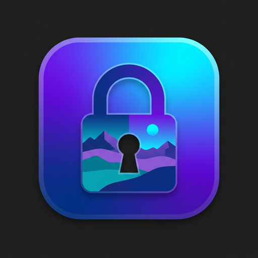
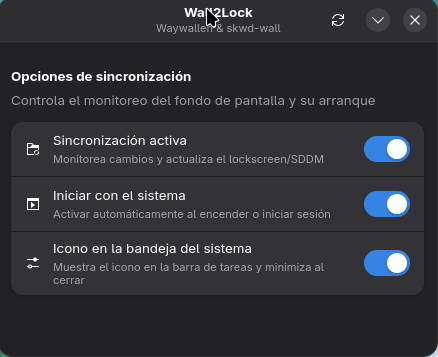

<p align="center">
  
</p>

<h1 align="center">Wall2Lock</h1>

<p align="center">
  <strong>The Missing Live Wallpaper Sync Experience for Linux 🎨🔒</strong><br>
  <em>Instantly sync your animated Wallpaper Engine, Waywallen & skwd-wall wallpapers to your Lock Screen & Login Greeter.</em>
</p>

<p align="center">
  <a href="#why-wall2lock">Why Wall2Lock?</a> •
  <a href="#screenshot">Screenshot</a> •
  <a href="#features">Features</a> •
  <a href="#installation">Installation</a> •
  <a href="#how-it-works">How It Works</a> •
  <a href="#troubleshooting--faq">FAQ</a>
</p>

<p align="center">
  
  
  
  
  
</p>

---

## Why Wall2Lock?

Tired of setting a stunning animated wallpaper on your Linux desktop with **Waywallen** or **skwd-wall**, only to lock your screen (`Super+L`) or turn on your computer and be greeted by a plain black background, a boring default image, or a blurry pixelated mess?

**Wall2Lock solves this once and for all.** 

It automatically detects your active desktop wallpaper—whether it's an interactive Wallpaper Engine scene, a high-definition video, or a dynamic canvas—and synchronizes it in crystal-clear full resolution directly to your **lock screen** and your **system boot login screen (GDM & SDDM)**:

- 🚀 **100% Automatic & Invisible:** Just pick or change your wallpaper in Waywallen or skwd-wall as you normally do. Wall2Lock detects changes instantly and updates your lock screen in milliseconds.
- 💎 **Ultra-High Resolution (Zero Pixelation):** Say goodbye to blurry 160x160 thumbnails. Wall2Lock unpacks raw native artwork (3897x2400+) directly from Wallpaper Engine `.pkg` scenes (`TEXV0005`), preserving razor-sharp detail in full 4:4:4 color quality.
- ⚡ **Zero Battery & CPU Drain (0.00% CPU at Idle):** No heavy background daemons or RAM hogs. Wall2Lock sleeps completely and only wakes up when triggered by kernel filesystem events (`systemd.path`).
- 🖥️ **Smart Multi-Monitor Compositing:** Dual or triple monitors with mixed resolutions (e.g. 2K + 1080p)? Wall2Lock maps your physical screen coordinates into a seamless canvas so your wallpaper is never stretched or deformed.
- 🐧 **Universal Desktop Support:** Works out-of-the-box on both **GNOME (GDM)** and **KDE Plasma (SDDM)** with a unified dual-engine architecture.
- 🎛️ **Minimalist Adwaita Control Panel:** Includes a sleek, modern GUI with system tray integration to pause sync, manage startup, or trigger an instant refresh with one click.

---

## Screenshot

<div align="center">
  
  <p><em>Wall2Lock's minimalist native Libadwaita control panel with system tray support. Toggle live sync, boot startup, and tray visibility in one click.</em></p>
</div>

---

## Features

- **Dual-Engine Auto-Detection:** Automatically senses whether you are using Waywallen (GNOME) or skwd-wall (KDE Plasma) without requiring manual configuration.
- **Boot Greeter Synchronization:** Syncs your wallpaper to **GDM** and **SDDM** so your customized background displays before you even log in or type your password.
- **Lock Screen Plugin Preservation:** On KDE Plasma, keeps `org.skwd.wall.plasma` active for live wallpaper animations while ensuring static fallbacks are always ready.
- **Native GPU Frame Capture:** Hooks directly into Waywallen's hardware renderer (`Gsk.Renderer.render_texture`) to capture interactive scene effects faithfully.
- **Deep Texture Extraction:** Decodes compressed LZ4/DXT5 packages and raw embedded JPEG/PNG textures from Steam Workshop items.
- **System Tray Quick Access:** Minimizes cleanly to your panel/tray via FreeDesktop `StatusNotifierItem` without cluttering your taskbar.
- **100% Safe & Reversible:** Creates automated safety backups of your login manager themes; restore original system defaults at any time with `--restore`.

---

## Installation

### Step 1: Install Dependencies

Open a terminal and install the required tools for your distribution:

<details open>
<summary><b>Select your Linux distribution:</b></summary>

* **Arch Linux / CachyOS / Manjaro:**
  ```bash
  sudo pacman -S python-pillow ffmpeg sqlite glib2 libadwaita
  ```

* **Ubuntu / Debian / Linux Mint / Pop!_OS:**
  ```bash
  sudo apt update && sudo apt install -y python3-pil ffmpeg sqlite3 libglib2.0-dev-bin gir1.2-adw-1
  ```

* **Fedora / Nobara / RHEL:**
  ```bash
  sudo dnf install -y python3-pillow ffmpeg sqlite glib2-devel libadwaita
  ```
</details>

---

### Step 2: One-Line Install (Copy & Paste)

Run this single command in your terminal to download and set up Wall2Lock:

```bash
git clone https://github.com/Rilorca/wall2lock.git && cd wall2lock && ./install.sh
```

> **What does the installer do?**
> 1. Installs `wall2lock-sync`, `wall2lock_extractor.py`, and `wall2lock-gui` into `~/.local/bin/`.
> 2. Sets up the high-resolution app icon and desktop launcher.
> 3. Enables `wall2lock.path` and `wall2lock.service` user units for 0% CPU reactive sync.
> 4. Performs an initial synchronization of your current active desktop wallpaper.

---

### Step 3: Configure the Login Manager (Required for GDM / SDDM)

To display your wallpaper immediately when powering on or rebooting your PC (the password greeter screen):

* **If you use GNOME (GDM):**
  ```bash
  sudo ./setup-gdm-theme.sh
  ```
  *(Safely creates a backup of your original theme and compiles the CSS rules into `gnome-shell-theme.gresource` with write permissions for your user).*

* **If you use KDE Plasma (SDDM):**
  ```bash
  sudo ./setup-sddm-theme.sh
  ```

> [!TIP]
> When running `./install.sh` in an interactive terminal, it will automatically ask if you want to run this step right away with `sudo`.

---

### Step 4: Open the Control Panel (Optional)

You can open the control center at any time by searching for **"Wall2Lock"** in your application launcher or running:

```bash
wall2lock-gui
```

From here you can:
- **Toggle 1 (Sincronización activa):** Pause or resume real-time wallpaper watching.
- **Toggle 2 (Iniciar con el sistema):** Enable or disable automatic startup on system boot.
- **Toggle 3 (Icono en la bandeja):** Show or hide the quick tray icon in your top bar / taskbar.
- **Button (`↻`):** Force an instant synchronization of your wallpaper right now.

---

## How It Works

```text
[ Desktop Wallpaper Manager ]
  Waywallen (GNOME) / skwd-wall (KDE Plasma)
             │
             ▼  (Changes wallpaper config / SQLite DB)
[ Linux Kernel inotify watcher ]
  systemd.path (0.00% CPU at idle, wakes up on file write)
             │
             ▼
[ Wall2Lock Extraction Engine ]
  • Decodes Wallpaper Engine scene.pkg (TEXV0005 / LZ4)
  • Extracts full-resolution video keyframe (ffmpeg)
  • Composites virtual multi-monitor canvas (monitors.xml)
             │
             ├──────────────────────────┐
             ▼                          ▼
   [ User Lock Screen ]       [ Login Greeter ]
   GNOME screensaver          GDM (GNOME)
   KDE kscreenlockerrc        SDDM (Plasma)
```

### 1. Reactive Kernel Monitoring (Zero CPU Overhead)
Instead of running a heavy background loop polling your files every second, Wall2Lock registers kernel-level `inotify` watches via `wall2lock.path`. It consumes literally **0.00% CPU** and **0 MB of RAM** while you work or game, waking up only for a fraction of a second when your wallpaper actually changes.

### 2. Deep High-Resolution Texture Extraction
Wallpaper Engine scene wallpapers (`scene.pkg`) store assets in custom binary containers. Wall2Lock's Python extraction engine decompresses LZ4 blocks and reads raw embedded JPEG and PNG images (`TEXV0005`) up to **3897x2400+**. For video wallpapers, it extracts uncompressed I-frames at full display resolution with full 4:4:4 chroma color fidelity.

### 3. Multi-Monitor Canvas Compositing
If you have multiple displays, stretching a single image across different aspect ratios causes ugly distortion. Wall2Lock inspects `monitors.xml` or Wayland output metrics, creating an exact multi-head composition (e.g. 4480x1440 for 2560x1440 + 1920x1080) so each display shows a sharp, pixel-perfect frame.

### 4. Safe Atomic Updates
Wall2Lock writes the rendered image using atomic file replacement (`safe_write_target`), preventing partially-written files or lock screen crashes.

---

## Troubleshooting & FAQ

<details>
<summary><b>How do I temporarily pause synchronization?</b></summary>

Open **Wall2Lock** from your application menu and toggle off **"Sincronización activa"**, or run:
```bash
systemctl --user stop wall2lock.path
```
</details>

<details>
<summary><b>How do I restore the original default GDM login screen?</b></summary>

Run the setup script with the `--restore` flag:
```bash
sudo ./setup-gdm-theme.sh --restore
```
Your original system gresource theme will be restored from backup immediately.
</details>

<details>
<summary><b>Does Wall2Lock work when switching between GNOME and KDE Plasma?</b></summary>

Yes! Wall2Lock features a dual-engine design. If you switch between GNOME (Waywallen) and KDE Plasma (skwd-wall), it automatically detects the running environment and targets the appropriate display manager without any manual re-configuration.
</details>

<details>
<summary><b>How do I check system service logs?</b></summary>

To inspect synchronization events in real-time:
```bash
systemctl --user status wall2lock.path
journalctl --user -u wall2lock.service -f
```
</details>

---

## Project Layout

```text
wall2lock/
├── assets/                     # Application icons and screenshots
│   ├── wall2lock.png           # Master 512x512 app icon
│   └── screenshot.png          # Control center screenshot
├── install.sh                  # Interactive installer and dependency verifier
├── sync-wall2lock.sh           # Main synchronization orchestrator
├── wall2lock_extractor.py      # High-res texture extraction & multi-monitor compositor
├── wall2lock_gui.py            # Minimalist Adwaita GUI & StatusNotifierItem tray manager
├── wall2lock-gui.desktop       # Desktop application entry
├── patch-renderer.py           # Dynamic GPU frame capture hook for Waywallen
├── setup-gdm-theme.sh          # GDM theme compiler and CSS injector
├── setup-sddm-theme.sh         # SDDM theme configuration helper
├── wall2lock.path              # systemd inotify watcher (0% CPU)
├── wall2lock.service           # Atomic systemd oneshot sync unit
├── build-plugin-zip.sh         # Packager for Waywallen's plugin manager
└── tests/
    └── run_tests.sh            # Automated test suite (22/22 tests passing)
```

---

## License

Distributed under the [MIT License](LICENSE).
